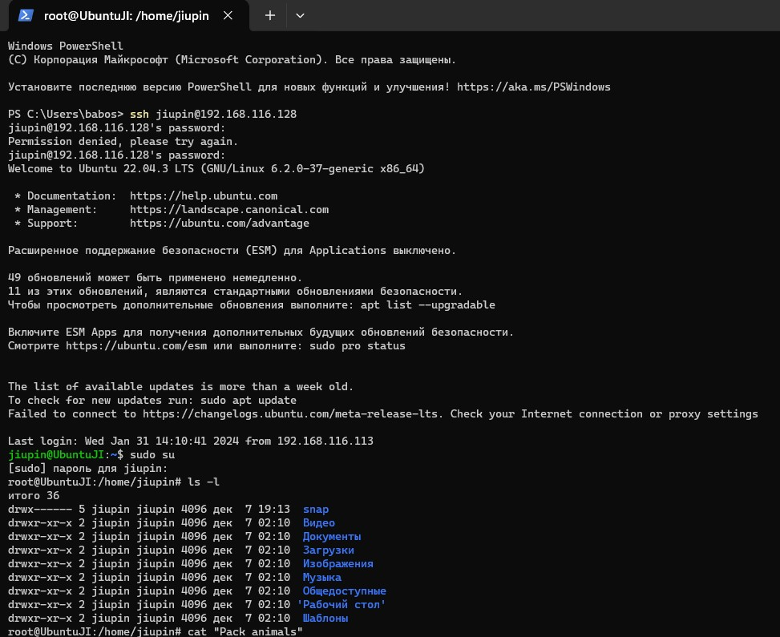
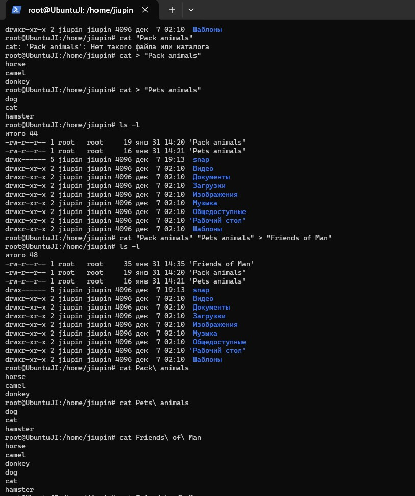
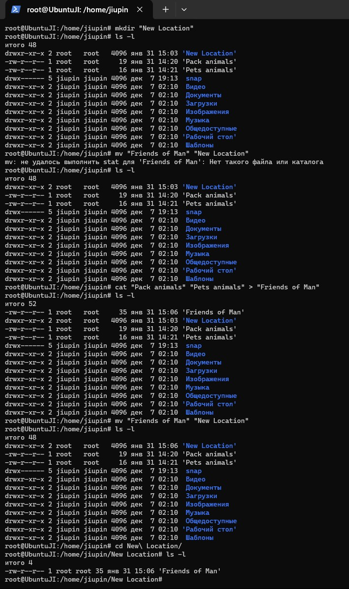
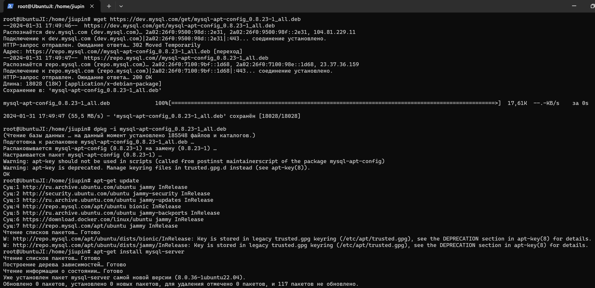
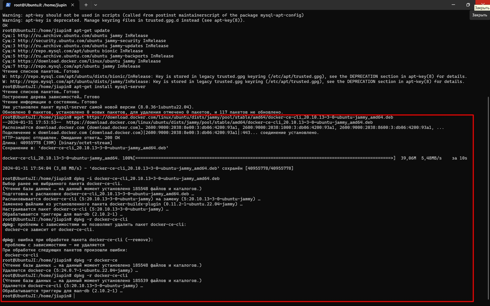
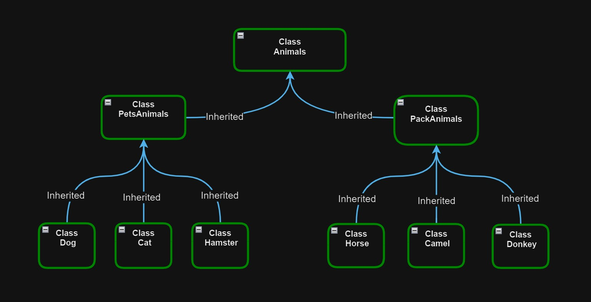
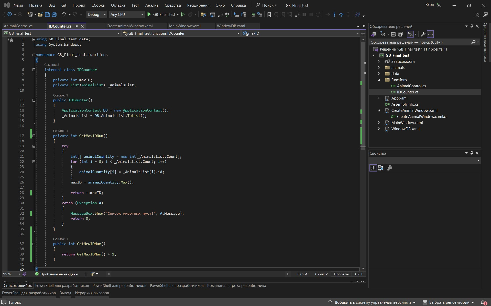

# Информация о проекте
Необходимо организовать систему учета для питомника, в котором живут
домашние и вьючные животные.

## Задания
1. Используя команду cat в терминале операционной системы Linux, создать
два файла Домашние животные (заполнив файл собаками, кошками,
хомяками) и Вьючные животными заполнив файл Лошадьми, верблюдами и
ослы), а затем объединить их. Просмотреть содержимое созданного файла.
Переименовать файл, дав ему новое имя (Друзья человека).




2. Создать директорию, переместить файл туда.



3. Подключить дополнительный репозиторий MySQL. Установить любой пакет
из этого репозитория.



4. Установить и удалить deb-пакет с помощью dpkg.



5. Выложить историю команд в терминале ubuntu.  
__Task 1__  
cat > "Pets animals"  
cat > "Pack animals"  
echo "собака, кошка, хомяк" > "Pets animals"  
echo "лошадь, верблюд, осёл" > "Pack animals"  
cat "Pets animals" "Pack animals" > "Friends of Man"  
cat "Friends of Man"  
__Task 2__  
mkdir "New Location"  
mv "Friends of Man" "New Location"  
__Task 3__  
apt-get update  
apt-get install mysql-server  
__Task 4__  
wget https://download.docker.com/linux/ubuntu/dists/jammy/pool/stable/amd64/docker-ce-cli_20.10.13~3-0~ubuntu-jammy_amd64.deb  
dpkg -i docker-ce-cli_20.10.13~3-0~ubuntu-jammy_amd64.deb  
dpkg -r docker-ce  
dpkg -r docker-cli

6. Нарисовать диаграмму, в которой есть родительский класс, а также классы домашние животные и вьючные животные, в составы которых, в случае домашних животных, войдут классы: собаки, кошки, хомяки, а в класс вьючные животные войдут: лошади, верблюды и ослы.



7. В подключенном MySQL репозитории создать базу данных “Друзья
человека”
```sql
DROP DATABASE IF EXISTS FriendsOfMan;
CREATE DATABASE FriendsOfMan;
USE FriendsOfMan;
```

8. Создать таблицы с иерархией из диаграммы в БД
```sql
DROP TABLE IF EXISTS Animal_Class;
CREATE TABLE Animal_Class
(
	Id INT AUTO_INCREMENT PRIMARY KEY, 
	Class_name VARCHAR(22)
);

INSERT INTO Animal_Class (Class_name)
VALUES ('Вьючные животные'),
('Домашние животные');  

DROP TABLE IF EXISTS Pack_animals;
CREATE TABLE Pack_animals
(
	  Id INT AUTO_INCREMENT PRIMARY KEY,
    Genus_name VARCHAR (22),
    Class_id INT,
    FOREIGN KEY (Class_id) REFERENCES Animal_Class (Id) ON DELETE CASCADE ON UPDATE CASCADE
);

INSERT INTO Pack_animals (Genus_name, Class_id)
VALUES ('Лошади', 1),
('Ослики', 1),  
('Верблюды', 1); 

DROP TABLE IF EXISTS Pets_animals;    
CREATE TABLE Pets_animals
(
	  Id INT AUTO_INCREMENT PRIMARY KEY,
    Genus_name VARCHAR (22),
    Class_id INT,
    FOREIGN KEY (Class_id) REFERENCES Animal_Class (Id) ON DELETE CASCADE ON UPDATE CASCADE
);

INSERT INTO Pets_animals (Genus_name, Class_id)
VALUES ('Коши', 2),
('Собаки', 2),  
('Хомячки', 2); 

DROP TABLE IF EXISTS Сats;
CREATE TABLE Сats 
(       
    Id INT AUTO_INCREMENT PRIMARY KEY, 
    Name VARCHAR(22), 
    Birthday DATE,
    Commands VARCHAR(50),
    Genus_id int,
    Foreign KEY (Genus_id) REFERENCES Pets_animals (Id) ON DELETE CASCADE ON UPDATE CASCADE
);
```
9. Заполнить низкоуровневые таблицы именами(животных), командами
которые они выполняют и датами рождения
```sql

INSERT INTO Сats (Name, Birthday, Commands, Genus_id)
VALUES ('Пумка', '2021-07-01', "котя-котя", 1),
('Тома', '2020-03-01', "кусь-кусь", 1),  
('Барсик', '2017-05-16', "мусь-мусь", 1); 

DROP TABLE IF EXISTS Dogs;
CREATE TABLE Dogs 
(       
    Id INT AUTO_INCREMENT PRIMARY KEY, 
    Name VARCHAR(22), 
    Birthday DATE,
    Commands VARCHAR(50),
    Genus_id int,
    Foreign KEY (Genus_id) REFERENCES Pets_animals (Id) ON DELETE CASCADE ON UPDATE CASCADE
);
INSERT INTO Dogs (Name, Birthday, Commands, Genus_id)
VALUES ('Клык', '2020-02-29', "сидеть, лапу, лежать, голос, фас", 1),
('Рекс', '2013-02-24', "сидеть, лапу, лежать, голос, фас", 1),  
('Дик', '2009-06-03', "сидеть, лапу, лежать, голос, фас", 1), 
('Шарик', '2015-05-12', "сидеть, лапу, лежать, голос, фас", 1);

DROP TABLE IF EXISTS Hamsters;
CREATE TABLE Hamsters 
(       
    Id INT AUTO_INCREMENT PRIMARY KEY, 
    Name VARCHAR(22), 
    Birthday DATE,
    Commands VARCHAR(50),
    Genus_id int,
    Foreign KEY (Genus_id) REFERENCES Pets_animals (Id) ON DELETE CASCADE ON UPDATE CASCADE
);
INSERT INTO Hamsters (Name, Birthday, Commands, Genus_id)
VALUES ('Пупс', '2022-11-21', "жрать", 2),
('Хорь', '2019-05-12', "спать", 2),  
('Хвостик', '2021-09-12', "какать", 2), 
('Боря', '2015-01-10', "лети", 2);

DROP TABLE IF EXISTS Horses;
CREATE TABLE Horses 
(       
    Id INT AUTO_INCREMENT PRIMARY KEY, 
    Name VARCHAR(22), 
    Birthday DATE,
    Commands VARCHAR(50),
    Genus_id int,
    Foreign KEY (Genus_id) REFERENCES Pack_animals (Id) ON DELETE CASCADE ON UPDATE CASCADE
);
INSERT INTO Horses (Name, Birthday, Commands, Genus_id)
VALUES ('Пегий', '2000-03-03', "рысь, оле, брр", 1),
('Сивка', '2020-01-19', "шагом, оле, хоп", 2),  
('Конь', '2005-07-10', "рысь, оле, брр", 1), 
('Игривый', '2001-10-15', "бегом, хоп, рысь", 3);

DROP TABLE IF EXISTS Donkeys;
CREATE TABLE Donkeys 
(       
    Id INT AUTO_INCREMENT PRIMARY KEY, 
    Name VARCHAR(22), 
    Birthday DATE,
    Commands VARCHAR(50),
    Genus_id int,
    Foreign KEY (Genus_id) REFERENCES Pack_animals (Id) ON DELETE CASCADE ON UPDATE CASCADE
);
INSERT INTO Donkeys (Name, Birthday, Commands, Genus_id)
VALUES ('Мерин', '2007-04-23', "сидеть, лежать, прыжок", 1),
('Каравай', '2023-01-11', "лежать, прыжок", 1),  
('Самец', '2017-11-07', "спать, молодец", 1), 
('Рокот', '2014-10-13', "сидеть, лежать, прыжок", 1);

DROP TABLE IF EXISTS Camels;
CREATE TABLE Camels 
(       
    Id INT AUTO_INCREMENT PRIMARY KEY, 
    Name VARCHAR(22), 
    Birthday DATE,
    Commands VARCHAR(50),
    Genus_id int,
    Foreign KEY (Genus_id) REFERENCES Pack_animals (Id) ON DELETE CASCADE ON UPDATE CASCADE
);
INSERT INTO Camels (Name, Birthday, Commands, Genus_id)
VALUES ('Табак', '2002-01-12', "галоп", 3),
('Гусь', '2019-06-02', "голос", 3),  
('Куча', '2015-08-16', "плюнь", 3), 
('Початок', '2003-12-11', "кусь", 3);
```

10. Удалив из таблицы верблюдов, т.к. верблюдов решили перевезти в другой питомник на зимовку. Объединить таблицы лошади, и ослы в одну таблицу.
```sql
SET SQL_SAFE_UPDATES = 0;
DELETE FROM Camels;

SELECT Name, Birthday, Commands FROM Horses
UNION SELECT  Name, Birthday, Commands FROM Donkeys;
```

11. Создать новую таблицу “молодые животные” в которую попадут все
животные старше 1 года, но младше 3 лет и в отдельном столбце с точностью до месяца подсчитать возраст животных в новой таблице
```sql
DROP TEMPORARY TABLE IF EXISTS Animals;
CREATE TEMPORARY TABLE Animals AS 
SELECT *, 'Лошади' as genus FROM Horses
UNION SELECT *, 'Ослики' AS genus FROM Donkeys
UNION SELECT *, 'Собаки' AS genus FROM Dogs
UNION SELECT *, 'Коши' AS genus FROM Сats
UNION SELECT *, 'Хомячки' AS genus FROM hamsters;

DROP TABLE IF EXISTS Young_animals;
CREATE TABLE Young_animals AS
SELECT Name, Birthday, Commands, genus, TIMESTAMPDIFF(MONTH, Birthday, CURDATE()) AS Age_in_month
FROM Animals WHERE Birthday BETWEEN ADDDATE(curdate(), INTERVAL -3 YEAR) AND ADDDATE(CURDATE(), INTERVAL -1 YEAR);
 
SELECT * FROM Young_animals;
```
12. Объединить все таблицы в одну, при этом сохраняя поля, указывающие на
прошлую принадлежность к старым таблицам.
```sql
SELECT h.Name, h.Birthday, h.Commands, pa.Genus_name, ya.Age_in_month 
FROM Horses h
LEFT JOIN Young_animals ya ON ya.Name = h.Name
LEFT JOIN Pack_Animals pa ON pa.Id = h.Genus_id
UNION 
SELECT d.Name, d.Birthday, d.Commands, pa.Genus_name, ya.Age_in_month 
FROM Donkeys d 
LEFT JOIN Young_animals ya ON ya.Name = d.Name
LEFT JOIN Pack_Animals pa ON pa.Id = d.Genus_id
UNION
SELECT c.Name, c.Birthday, c.Commands, ha.Genus_name, ya.Age_in_month 
FROM Сats c
LEFT JOIN Young_animals ya ON ya.Name = c.Name
LEFT JOIN Pets_Animals ha ON ha.Id = c.Genus_id
UNION
SELECT d.Name, d.Birthday, d.Commands, ha.Genus_name, ya.Age_in_month 
FROM Dogs d
LEFT JOIN Young_animals ya ON ya.Name = d.Name
LEFT JOIN Pets_Animals ha ON ha.Id = d.Genus_id
UNION
SELECT hm.Name, hm.Birthday, hm.Commands, ha.Genus_name, ya.Age_in_month 
FROM Hamsters hm
LEFT JOIN Young_animals ya ON ya.Name = hm.Name
LEFT JOIN Pets_Animals ha ON ha.Id = hm.Genus_id;
```

13. Создать класс с Инкапсуляцией методов и наследованием по диаграмме.
14. Написать программу, имитирующую работу реестра домашних животных.
В программе должен быть реализован следующий функционал:    
	14.1 Завести новое животное    
	14.2 определять животное в правильный класс    
	14.3 увидеть список команд, которое выполняет животное    
	14.4 обучить животное новым командам    
	14.5 Реализовать навигацию по меню    
15. Создайте класс Счетчик, у которого есть метод, увеличивающий̆
значение внутренней̆ int переменной̆ на 1 при нажатии “Завести новое животное” Сделайте так, чтобы с объектом такого типа можно было работать в блоке try-catch. Нужно бросить исключение, если работа с объектом типа счетчик была не в ресурсном try и/или ресурс остался открыт. Значение считать в ресурсе try, если при заведении животного заполнены все поля.


